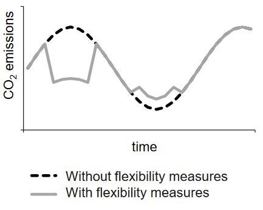

# CO2 and Cost Reduction Calculator for Flexibility Measures

This CO2 calculator library was published within the Kopernikus project [SynErgie](https://synergie-projekt.de/).
This calculator allows the user to compute the CO2 and cost reduction potential of energy flexibility measures. The user can decide to calculate the reduction potential with regard to the maximum CO2 reduction and/or the maximum cost reduction. Furthermore, the user has the option to calculate the reduction potential for a combination of load reduction and increase measures, when the parameters of the respective flexibility measures allow so.

## Dependencies

The calculator requires:
-	Pandas

## Usage

```python
if __name__ == "__main__":
    if args.filename == "":
        #TODO: add required parameters in the brackets when executing in an IDE
        main()
    else:
        #code when executing via the command line
        main(args.filename,args.year,args.combination,args.max_co2,args.max_cost)
```
1.	Prepare semicolon separated csv-files in the `data` directory, as they contain the data basis for the calculation. It is important to maintain their format!
    - `dsm-rohdaten.csv`: parameters of the energy flexibility measures
    - `mittlere_preise_und_emf.csv`: average annual emission factors and electricity prices. Already includes data for the target years 2019 -2023. 
    - `preis_und_emf_{year}.csv`: quarter-hourly time series of prices and emission factors for the respective target years. The directory already includes files with time series for 2019 – 2023. 
2.	The calculation can be initiated via the command line or manually in an IDE by executing `co2-calculator.py`. The following parameters can be set to control the mode of calculation:
    - `filename`: File name of the results file.
    - `year`: Year on which the calculation should be based on: 2019, 2020, 2021, 2022 or 2023.
    - `combination`: Decide on whether to consider a combination of load reduction and load increase if the parameters of the respective flexibility measures allow so.
    - `max_co2`: Decide if the reduction potential should be calculated by optimizing the maximum CO2 reduction potential.
    - `max_cost`: Decide if the reduction potential should be calculated by optimizing the maximum cost reduction potential.


## Methodology

For the calculation of the CO2 reduction potential, it is assumed that work is shifted from periods of high specific emissions to periods of low emissions and is compensated for at average specific emissions.

[^1][^2]
 
The CO2 reduction potential of a flexibility measure with the retrieval duration *n* at time *i* is calculated as follows:

[^1][^2]

Equivalent formula is applied for the calculation of the cost reduction potential.

After calculating the reduction potentials for every quarter of an hour with the given formula, the time series of reduction potentials is split into blocks with the size *n* of a retrieval cycle. Each block is the represented by the quarter of an hour with the maximum reduction potential within the block. 

[^1][^2]

The annual reduction potential is aggregated based on the retrieval frequency *k*, such that the *k* blocks with the highest reduction potential are summed up.

## Used data
- Electricity prices [€/MWh] for the quarter-hourly time series of the target years 2019 - 2023 were downloaded from Energy-Charts[^3].
- Emission factors [g CO2-eq./kWh] for the quarter-hourly time series of the target years 2019 - 2023 were generated with the CO2 footprint electricity German library[^4]. However, the initial emission factors for each production type were substituted by the factors from the CO2-Monitor[^5].
- Average emmission factors [g CO2-eq./kWh] for the target years 2019 - 2023 stem from the CO2-Monitor[^5].
- Average electricity prices [€/MWh] for the target years 2019 - 2023 were calculated from the quarter-hourly time series of electricity prices downloaded from Energy-Charts[^3].


## References

[^1]: [Zachmann, Bastian; Seifermann, Stefan: CO2-Vermeidungspotential beim Einsatz von Maßnahmen industrieller Nachfrageflexibilität; 12. Internationale Energiewirtschaftstagung an der TU Wien (IEWT), 2021.](https://opus.bib.hs-mannheim.de/frontdoor/index/index/searchtype/all/docId/351/start/0/rows/10)

[^2]: [Gabrek, Nadine; Ackermann, Lena; Seifermann, Stefan: Load increase vs. load reduction: the impact of load shifting on the CO2 reduction potential in the context of industrial demand side flexibility; 18. International Conference on Energy Economics and Technology (ENERDAY), Dresden, 2024.](https://tu-dresden.de/bu/wirtschaft/bwl/ee2/ressourcen/dateien/tagungen/enerday/enerday-2024/praesentationen/01-Gabrek.pdf)

[^3]: [Fraunhofer-Institut für Solare Energiesysteme ISE: Energy-Charts.](https://www.energy-charts.info/index.html?l=de&c=DE)

[^4]: [Production Management, Technology and Machine Tools - PTW of the TU Darmstadt: CO2 footprint electricity German.](https://git.ptw.maschinenbau.tu-darmstadt.de/eta-fabrik/public/co2-footprint-electricity-german/-/tree/main?ref_type=heads)

[^5]: [TenneT, FfE: CO2-Monitor](https://co2-monitor.org/)


## Authors and acknowledgments
Hochschule Mannheim - Mannheim University of Applied Sciences - Germany (https://www.hs-mannheim.de/)

This work, developed as part of the Kopernikus project SynErgie, was supported by the German Federal Ministry for Education
and Research and the project executing organization Jülich [03SFK3U2-3].
